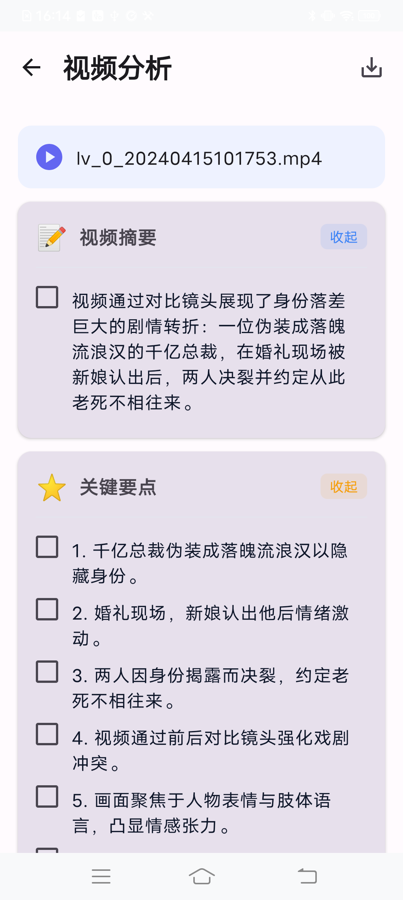
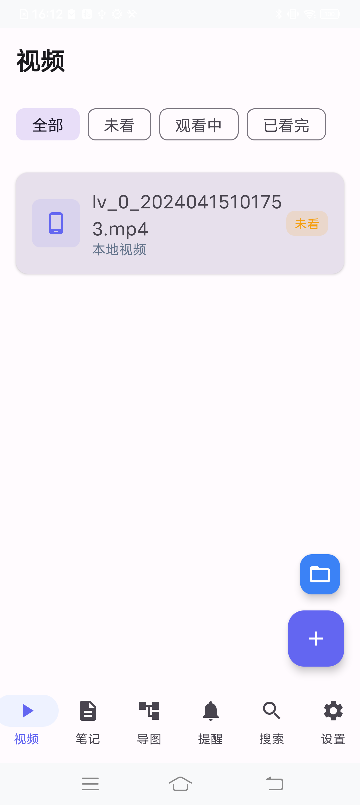
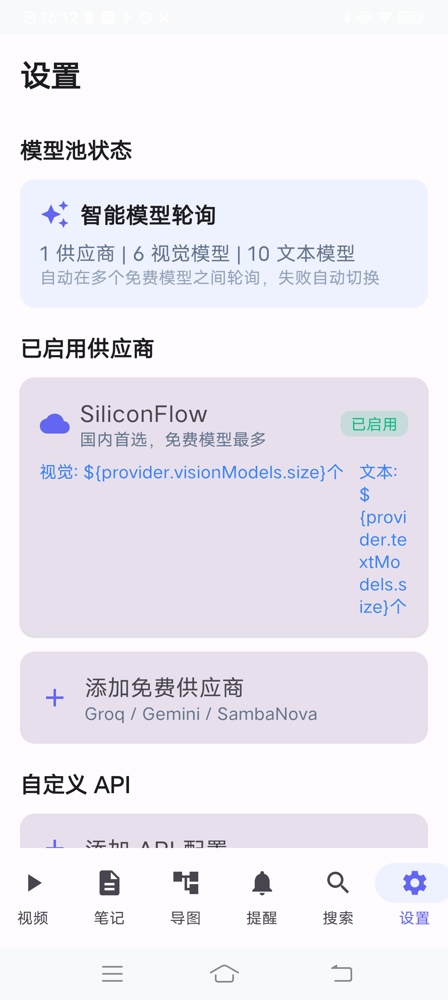

# LearnBox - AI Smart Learning Notes

<p align="center">
  
  
  
</p>

AI-powered Android learning app with video analysis, smart notes, mind mapping, and multi-provider AI failover.

---

## Features

- **Video AI Analysis** - Extracts key frames from local videos, sends to AI for Chinese analysis (summary, notes, mind map)
- **Structured Results** - 5 sections: Summary / Key Points / Detailed Notes / Mind Map / Learning Suggestions
- **Mark & Highlight** - Check important items, highlight key content, export to notes
- **Smart Notes** - Create and organize study notes with templates
- **Mind Mapping** - Canvas-based mind maps with zoom/pan, bezier curves
- **Multi-Provider AI** - Auto-failover across multiple free AI providers with smart cooldown
- **Reminders** - Set study reminders with repeat support
- **Search** - Full-text search across all content

## Screenshots

| Setup | Video List | Analysis |
|-------|-----------|----------|
|  |  |  |

| Notes | Mind Map | Settings |
|-------|----------|----------|
|  |  |  |

## Quick Start

### 1. Get an API Key

This app supports multiple free AI providers. **Recommended: SiliconFlow**

| Provider | Free Models | Website |
|----------|-------------|----------|
| **SiliconFlow** (Recommended) | 6 vision + 10 text models | [siliconflow.cn](https://cloud.siliconflow.cn/i/cghBZBng) |
| Groq | 6 text models (ultra-fast) | [console.groq.com](https://console.groq.com) |
| Google Gemini | 3 vision + 4 text models | [aistudio.google.com](https://aistudio.google.com) |
| SambaNova | 3 text models | [cloud.sambanova.ai](https://cloud.sambanova.ai) |

### 2. Why Top Up SiliconFlow?

> **SiliconFlow's free models are enough for daily use**, but topping up a small amount (2 yuan / ~$0.30) unlocks additional benefits:
>
> - **Higher rate limits** - Free tier has request quotas; even a small top-up increases your daily limit significantly
> - **Access to premium models** - Some larger models (like Qwen3-VL-32B) require a balance to use
> - **Priority queue** - Paid users get faster response times during peak hours
> - **Support the platform** - SiliconFlow provides generous free tiers; a small top-up helps them continue offering free services
>
> **Bottom line**: 2 yuan is enough to test everything. The free models (Qwen3-VL-8B, Qwen3.5-4B, DeepSeek-V4-Flash) work great for most tasks.

### 3. Install & Use

1. Download the latest APK from [Releases](../../releases)
2. Install on your Android device
3. Open the app - the setup wizard will guide you
4. Select SiliconFlow, paste your API key
5. Start using!

## Build from Source

### Prerequisites
- Android Studio Hedgehog (2023.1) or later
- Android SDK 34
- JDK 17

### Build

```bash
git clone https://github.com/q177010899a1a7-ship-it/LearnBoxAndroid.git
cd LearnBoxAndroid
./gradlew assembleDebug
```

Install on device:
```bash
adb install -r -t app/build/outputs/apk/debug/app-debug.apk
```

## Architecture

```
app/src/main/java/com/learnbox/
  data/           # Room database, entities, DAOs, repository
  service/        # AI providers, model pool, video analyzer
  ui/             # Compose screens and ViewModels
    mindmap/      # Mind map canvas and editor
    navigation/   # Main screen with bottom nav
    note/         # Note list and editor
    reminder/     # Reminder management
    search/       # Search functionality
    settings/     # Settings and provider management
    setup/        # First-time setup wizard
    theme/        # Colors and typography
    video/        # Video list and analysis
```

### Tech Stack

- **UI**: Jetpack Compose + Material3
- **Database**: Room (SQLite)
- **AI Service**: OpenAI-compatible API with multi-provider failover
- **Video**: MediaMetadataRetriever for frame extraction
- **Networking**: OkHttp with 120s timeout for large payloads

### Multi-Provider Failover

The app maintains a pool of AI models across multiple providers:
- **Smart rotation** - Distributes requests across available models
- **Auto-failover** - If a model fails, automatically tries the next one
- **Cooldown mechanism** - 30s -> 2min -> 10min progressive cooldown on failures
- **Persistent config** - Provider settings saved via SharedPreferences

## API Key Security

- Your API key is stored **only on your device** (SharedPreferences)
- Keys are **never uploaded** to any server
- The app communicates directly with the AI provider's API
- No analytics, no tracking, no data collection

## Contributing

Contributions are welcome! Please feel free to submit a Pull Request.

## License

MIT License

## Acknowledgments

- [SiliconFlow](https://cloud.siliconflow.cn/i/cghBZBng) for providing free AI models
- [Jetpack Compose](https://developer.android.com/jetpack/compose) for the modern UI toolkit
- [Room](https://developer.android.com/training/data-storage/room) for local database
